# ROS-Code-Intelligence-Web-Platform

ROS2 Advanced Auditor is a platform that automatically analyzes ROS2 projects via ZIP archive uploads. It performs an in-depth analysis of the system's architecture, behavior, and communications.
Getting Started

# Prerequisites

Python 3.10+

A ROS2 Workspace (zipped) for analysis.

# Installation

1. Clone the repository(or navigate to the folder).
2. Install dependencies:

    -pip install fastapi uvicorn python-multipart networkx matplotlib PyYAML

# Running the Project

Launch the FastAPI server using the following command:

   -python3 -m uvicorn main:app --host 0.0.0.0 --port 8000 --reload

Launch the frontend by opening the index.html file.

# Analysis Engine Logic

# 1. Extraction & Structural Validation

The platform ensures the uploaded ZIP is a valid ROS2 workspace.

 **Session Isolation**: Every upload generates a unique `UUID` to prevent data cross-contamination.
 **Workspace Validation**: The `validator.py` module checks for mandatory ROS2 structures (e.g., `package.xml`, `src` folders).

  The **validator.py** module is a sophisticated static analysis tool for ROS2 workspaces that performs comprehensive syntax, semantic, and architectural validation across multiple file     types and languages.
      -File Classification → Determine file type and purpose
  
      -Pattern Matching → Regex + AST parsing for each language
  
      -Context Analysis → Understand usage patterns
  
      -Cross-Reference → Validate workspace-wide consistency
  
      -Report Generation → Structured output with fixes

# 2. Multi-language node detection and launch file analysis through a hybrid approach.

The engine performs static analysis on source files to identify ROS2 entities:

**Python (AST Analysis)**: Instead of simple text search, it uses the Abstract Syntax Tree (AST) to: Detect classes inheriting from rclpy.Node, Identify calls to create_publisher(), create_subscription(), create_service(), ActionServer, and declare_parameter() and Extract topic names, service types, action names, and parameter declarations with precise argument resolution.

**C++ (Regex Pattern Matching)**: High-performance regular expressions extract node definitions and middleware interface declarations from `.cpp` and `.hpp` files.

The code performs intelligent **launch file detection** and analysis across multiple formats. It identifies Python, XML, and YAML launch files using 6 detection criteria, extracts nodes and parameters with pattern matching, organizes them by package, and provides detailed statistics on launch file distribution and usage patterns.

# 3. Architectural Layer Classification

Each detected node is mapped to one of seven functional layers based on its naming convention and interface metadata:

| Layer | Primary Role |
| --- | --- |
| **Perception** | Data acquisition (LiDAR, Camera, IMU). |
| **Planning** | Decision making, path planning, and navigation. |
| **Control** | Closed-loop regulation (PID, `cmd_vel`). |
| **Execution** | Hardware abstraction and low-level drivers. |
| **Supervision** | System health, diagnostics, and monitoring. |
| **Infrastructure** | System services (TF, Bridges, Loggers). |
| **Other** | Fallback for unclassified utility nodes. |

    The analysis engine employs a sophisticated multi-criteria algorithm to categorize nodes. The classification process features:

        -Multi-source analysis: Combines node name, topics, services, and actions

        -Hierarchical prioritization: Logical layer order (Perception → Planning → Control → ...)

        -Contextual understanding: Semantic analysis of complete node content

        -Automated visualization: Automatic Mermaid diagram generation

        -Intelligent fallback: Dedicated "other" layer for ambiguous cases

        -Quantified metrics: Statistical distribution analysis across layers

### 4. Behavioral & Criticality Analysis

The platform calculates metrics to evaluate system performance:

**Frequency Grading**:

**ULTRA_HIGH (≥100 Hz)**: Hardware-critical tasks.

**HIGH (≥50 Hz)**: Strict real-time loops.

**MEDIUM (≥20 Hz)**: Standard processing.

**Cognitive Load**: A score derived from the ratio of input/output interfaces, identifying "God Nodes" that might become bottlenecks.

# For Communication Chains:

1. **Collection** → All publishers/subscribers grouped by topic
2. **Construction** → Node-to-node adjacency matrix
3. **Exploration** → BFS for all possible paths
4. **Sorting** → By descending length
5. **Extraction** → Longest chain identification

# For TF Tree:

1. **Scan** → URDF/XACRO files and source code
2. **Extraction** → Parent→child relationships
3. **Construction** → TF-specific nodes and edges
4. **Visualization** → Hierarchical diagram generation

# Technology Stack

**Backend**: FastAPI (Python)

**Graph Theory**: NetworkX

**Data Visualization**: Matplotlib (Agg backend)

**Frontend**: HTML5 / JavaScript (Tailwind CSS)

**Diagrams**:	Mermaid.js

# Platform Visualization

**The first interface you will encounter is shown below**
: 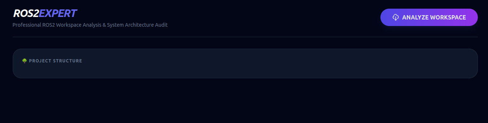

**When you click on "Analyze Workspace," a file selection window will open, and you must select a zipped (.zip) ROS2 workspace folder.**:
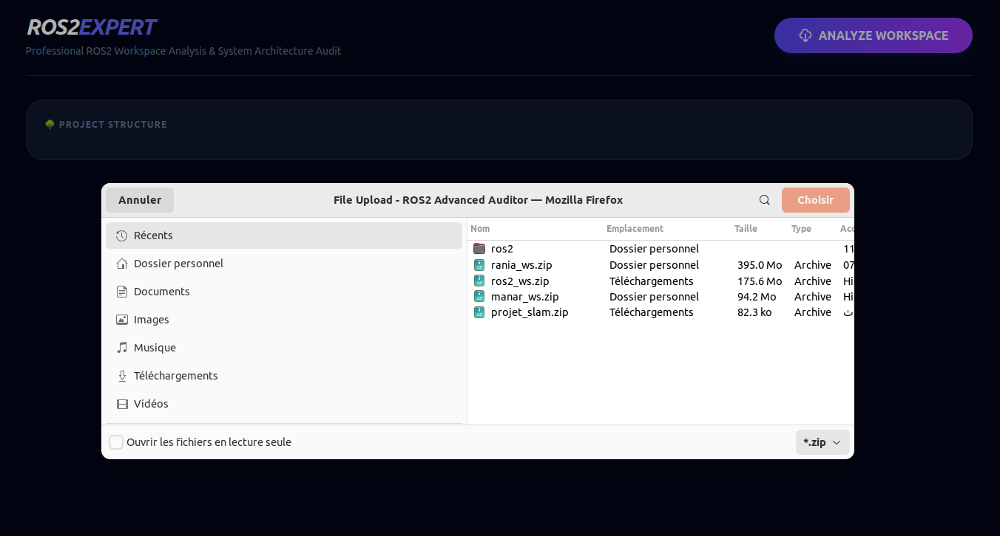

**The project interface will be open and you'll see System Statistics showing the numbers of nodes, topics, services, and actions. Then, you'll find the Project Structure and ROS2 Packages Detected section, which presents crucial architectural insights we'll explore next.**:
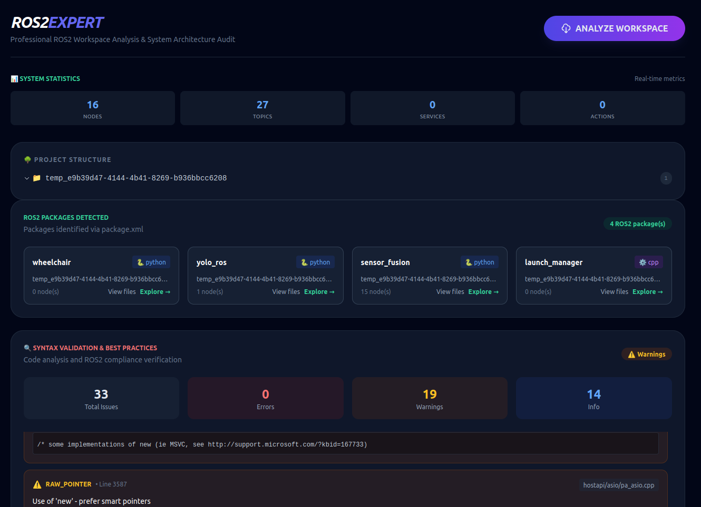

**You can expand the tree view to explore your project packages and files.**: 
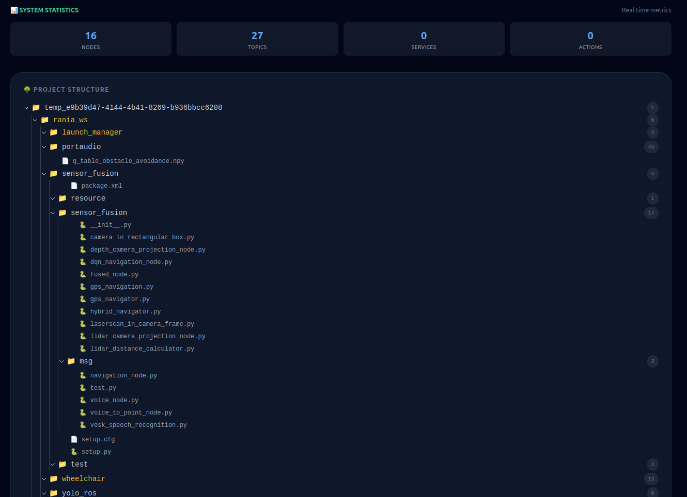

**Now let's return to the ROS2 Packages section, which contains nodes, launch files, graph visualizations, and communication analysis.(aking the sensor fusion package as an example)**: 
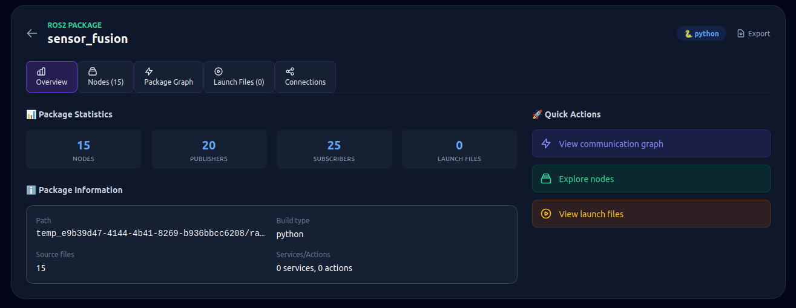

**This view displays the nodes detected within each package, along with their associated interfaces:**:
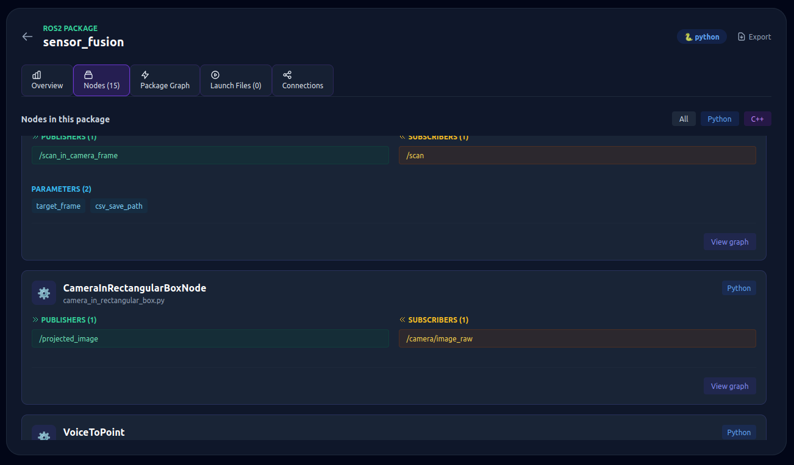

**This view displays the packages communication graph.**:
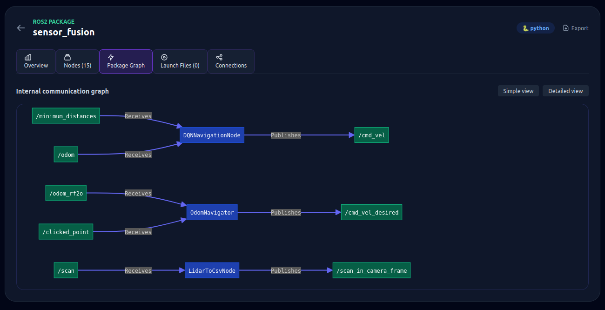

**You can expand the tree view to explore your project packages and files.**: 
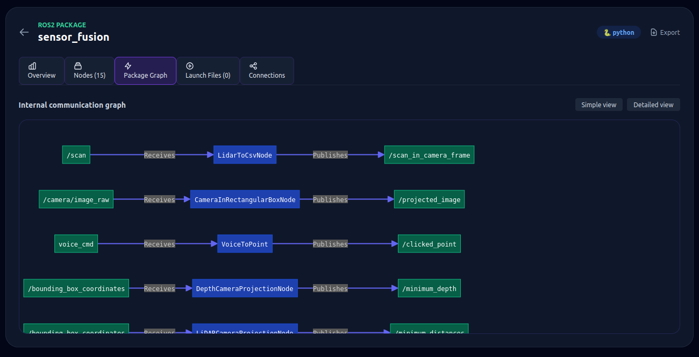

**This view displays topics, services, and actions.**: 
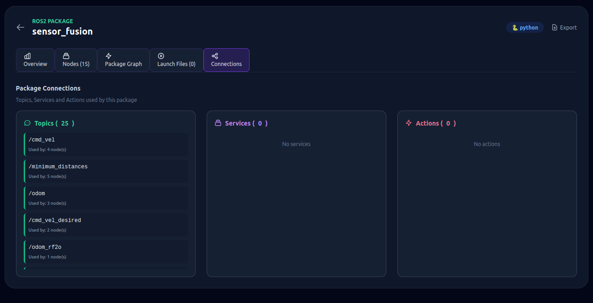

**This view displays launch files in the wheelchair package.**:
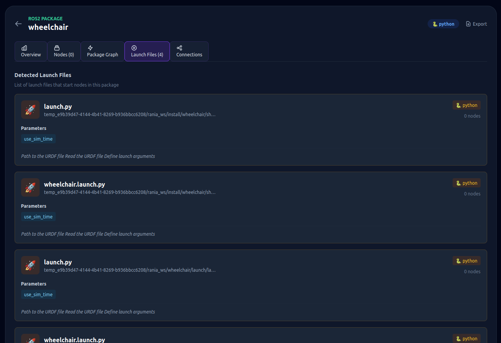

**Now let's proceed to the Syntax Validation and Best Practices display section.**:
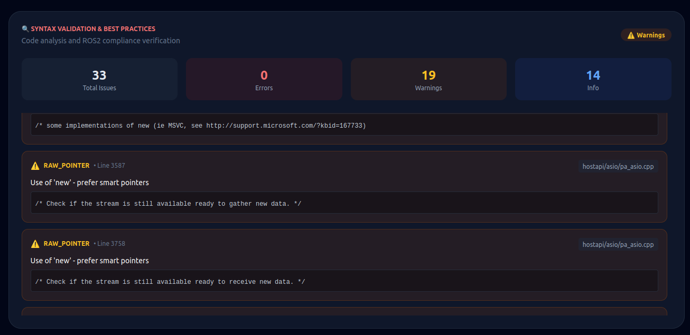

**The following section is Professional Behavioral Analysis, featuring three key subsections: Performance Analysis, Decision Making , and Architecture Layers Classification.**: 
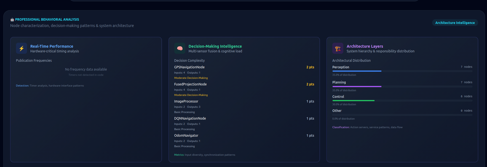

**The next section displays the longest communication chain**:
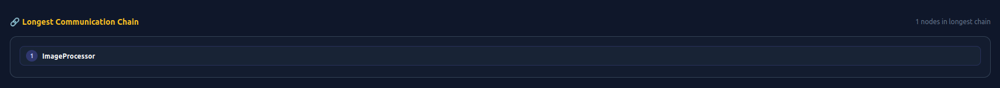

**The next section displays the Architecture System Overview section.**:
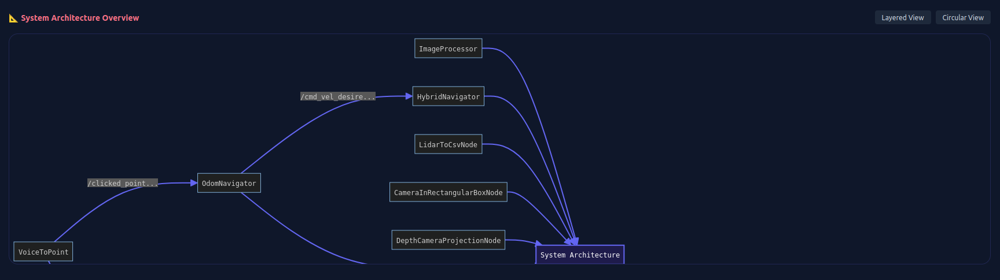

 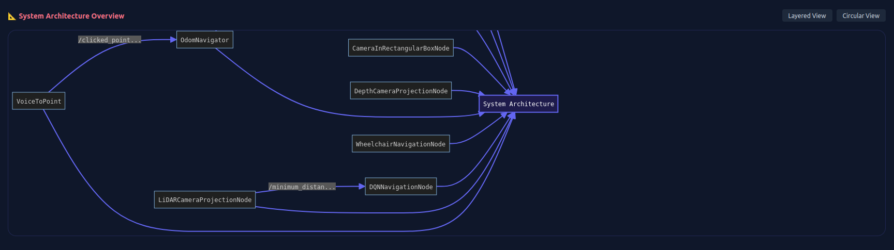

**The following section presents the TF (Transform) tree visualization.**:
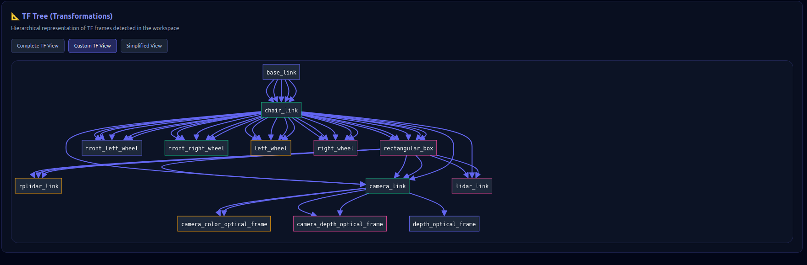

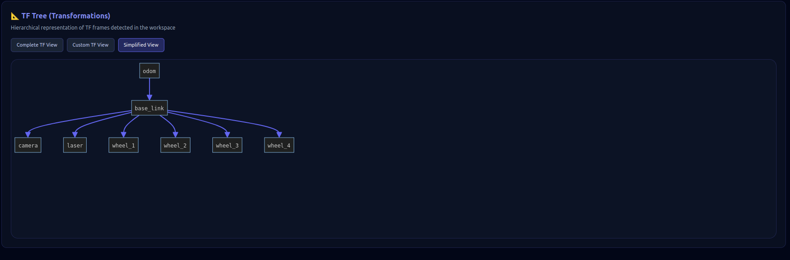

